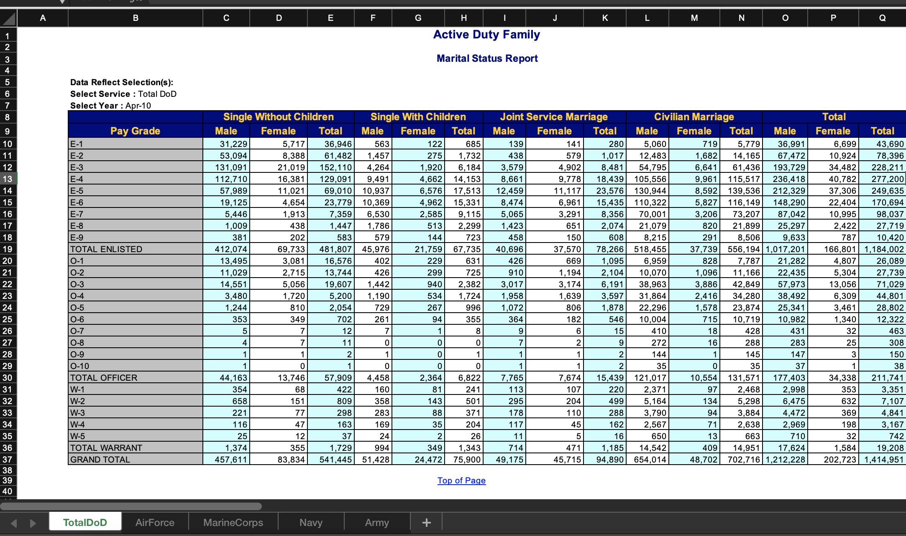

```{r setup, include=FALSE, message=FALSE}
knitr::opts_chunk$set(echo = TRUE)
library(here)
library(tidyverse)
library(readxl)
file_path <- here("R","data","ActiveDuty_MaritalStatus.xls")
```

## Marital DOD Data
  
The data come from data.gov. The file contains count data on the marital statuses of military service members, as well as their pay grade/family status. The data file is called `ActiveDuty_MaritalStatus.xls`.
  
**BUT...**  
  
These data are not optimized for `R`.
  

  
So we will need to do some work to read in the data.
  
### Reading in the data - First Excel Sheet
  
While eventually we will want to read in all the sheets at once, we will start out by reading in the first Excel Sheet, *TotalDoD* (see above).
  
We will use the `read_excel()` function from the `readxl` package.
  
First, we're going to manually specify the names of our columns. This involves doing a bit hard coding (reading in messy data is the only time hard coding is recommended!).
  
```{r}
col_names_dod <- c("pay_grade","single_withoutchildren_male",
                                    "single_withoutchildren_female",
                                    "single_withoutchildren_total",
                                    "single_withchildren_male",
                                    "single_withchildren_female",
                                    "single_withchildren_total",
                                    "married_jointservice_male",
                                    "married_jointservice_female",
                                    "married_jointservice_total",
                                    "married_civilian_female",
                                    "married_civilian_male",
                                    "married_civilian_total",
                                    "married_male_total",
                                    "married_female_total",
                                    "married_total_total")
```
  
Note that we named these columns so they can be adequately separated later on.
  
Next we have to use `read_excel()`, but we have to specify a number of argumnets. We first specify the `path` (note - `file_path` is a variable that I created ahead of time to be specific to my computer. Yours will be different). Next, we specify `sheet`, the number of the sheet we wish to read in (we can also specify the sheet name). Next, we carefully chooose the `range` of cells in the file we read in, based on our visual inspection of the file. This is another case where we must hard-code it. Here, we want the range to go from `B10` to `Q37`. We also need to manually specify `col_names` from our `col_names_dod` vector that we created above. Once we read it in, we will remove any rows containing the word "total" from the column `pay_grade`

```{r}
file_path
marital_dod_1 <- read_excel(path=file_path,
                      sheet = 1, range = "B10:Q37",col_names = col_names_dod) %>%
  filter(str_detect(pay_grade, regex("total",ignore_case = TRUE),negate = T))
marital_dod_1
```
  
We've read in the data!
  
This `tibble` looks okay, but there's still much work to be done. First, we need to remove any of the columns that contain the word `"total"`. We don't need these aggregated totals, as they will only muddle the data (plus we can calculate them ourselves if needed).
  
```{r}
marital_dod_2 <- marital_dod_1 %>%
  select(c(pay_grade,!contains("total")))
marital_dod_2
```
  
Next, we'll use `pivot_longer()` to combine the column names (except for `pay_grade`) into a single column, `status`. We do this because the variable `status` is currently spread across columns (it is **wide**). We want our data to be tidy - where each row is a single observation.
  
We specify `cols` as every column **except** `pay_grade` with `!contains(pay_grade)`. We also specify that the column names will be moved to `status` and the column values will be moved to `count`. 
  
```{r}
marital_dod_3 <- marital_dod_2 %>%
  pivot_longer(cols = !contains("pay_grade"),
               names_to = "status", values_to = "count")
marital_dod_3
```
  
Our data is now tidy! Now we have just a bit more to do. We should use `separate()` to separate `pay_grade` into two columns (`enlisted` and `pay_grade`), as well as separate `status` into three columns (`relationship`, `family_status`, and `gender`).
  
```{r}
marital_dod_tidy <- marital_dod_3 %>%
  separate(col=pay_grade, into=c("enlisted","pay_grade"),
           sep="-") %>% 
  separate(col=status, into = c("relationship", "family_status","gender"),
           sep = "_")
marital_dod_tidy
```
  
Whala! We successfully read in and cleaned a very messy Excel spreadsheet. Next, we will use the `purrr` package to read multiple sheets at once.
  
### Reading in the Data - All Sheets
  
As we saw, there are multiple sheets in `ActiveDuty_MaritalStatus.xls`. We will need to do a bit of work to read them all in, while maintaining best practices (i.e., **NOT** copying and pasting code).
  
First, we define the column names we want. Note that this is the same as above, but we need to include am empty string, since we will be forced to read in the "first" column (which is empty).
  
```{r}
col_names_all <- c(" ", "pay_grade","single_withoutchildren_male",
              "single_withoutchildren_female",
              "single_withoutchildren_total",
              "single_withchildren_male",
              "single_withchildren_female",
              "single_withchildren_total",
              "married_jointservice_male",
              "married_jointservice_female",
              "married_jointservice_total",
              "married_civilian_female",
              "married_civilian_male",
              "married_civilian_total",
              "married_male_total",
              "married_female_total",
              "married_total_total")
```
  
Next, we use the `excel_sheets()` function to extract a character vector of all sheet names from our file
  
```{r}
sheets <- excel_sheets(file_path)
sheets
```
  
Next, is the bulk of our workload. We write a custom function that will read in each sheet, as well as clean and tidy it. The function is called `read_mar_sheets()`, and it takes a single argument: `sheet_name`.
  
The function first reads in the data, using `read_excel()`. Note that we specify the `path `from the `file_path` variable I created above. The `sheet` is specified by the user as `sheet_name`. We also ask `read_excel()` to trim whitespace (`trim_ws=TRUE`). The `col_names` are defined with `col_names_all` from above, and `skip=9` tells `read_excel()` to skip the first 9 rows (this number comes from a visual inspection of the Excel file).
  
After the sheet is read in, we use the pipe (`%>%`) to continue perfoming operations on it. We create a column `branch`, equal to the value of `sheet_name`. Then, we use `select(-c(` `))` to remove the first column from the data (recall that the first column is blank). We then use `select(c(pay_grade, !contains("total")))` to remove any columns with the word "total" in their name.
  
`filter(str_detect(pay_grade, regex("total",ignore_case = TRUE),negate = T))` removes the word "total" from the column `pay_grade`.
  
Just like above, we use `pivot_longer()` to make the data tidy, and then use `separate()` to separate out `pay_grade` and `status` into different columns.
  
This whole operation assigns a `tibble` to `data` (in the function scope), and a `return` statement returns this tibble to the user.
  
```{r}
read_mar_sheets <- function(sheet_name){
  data <- read_excel(path = `file_path`,
             sheet = sheet_name,
             trim_ws = TRUE,
             col_names = col_names_all,
             skip=9) %>% 
    mutate("branch"=sheet_name) %>%
    select(-c(` `)) %>% # immediately remove out blank column
    select(c(pay_grade,!contains("total"))) %>% # remove columns with the word total
    filter(str_detect(pay_grade, regex("total",ignore_case = TRUE),negate = T)) %>%
    pivot_longer(cols = !contains(c("pay_grade","branch")), # these columns can remain as is
               names_to = "status", values_to = "count") %>% 
    separate(col=pay_grade, into=c("enlisted","pay_grade"),
             sep="-") %>% 
    separate(col=status, into = c("relationship", "family_status","gender"),
           sep = "_")
  return(data)
}
```
  
Our function is obviously customized for this specific operation. It also contains some hard coding, which is necessary given the data file. However, note that the sheets are actually fairly consistent (e.g., the same amount of white space, very similar row values, etc.). In the future, you may encounter even trickier Excel files, which will require creative programming to read into `R`.  
  
We can efficiently use this function with `purrr::map()` to read in all our sheets simulataneously. `purrr` is package that's part of the tidyverse, and it contains functions (like `map()` that allow us to vectorize operations.
  
Here is an example, using a simple custom function called `add_1`, which adds 1 to its input.
```{r}
x <- c(1,2,3,4,5)
add_1 <- function(x) x+1
purrr::map(x, add_1)
```
  
Going back to vector `sheets`, we can use `purrr:map()` to vectorize our read-in operation. This wil create a list of tibbles, which can then be easily bound together into one large tibble using `bind_rows()`.
  
```{r message=F}
data_list <- purrr::map(sheets, read_mar_sheets)
data_list
```

```{r}
marital_tidy_all <- data_list %>% 
  bind_rows() 
marital_tidy_all
```
  
## Conclusion
  
You now know more about reading in messy data files to `R`. This is by no means the only solution to this problem. You may have even found a way that's more efficient!
